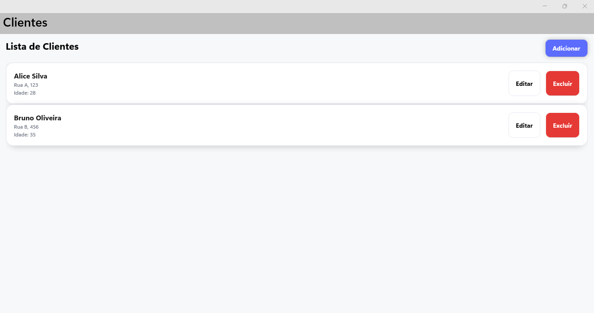
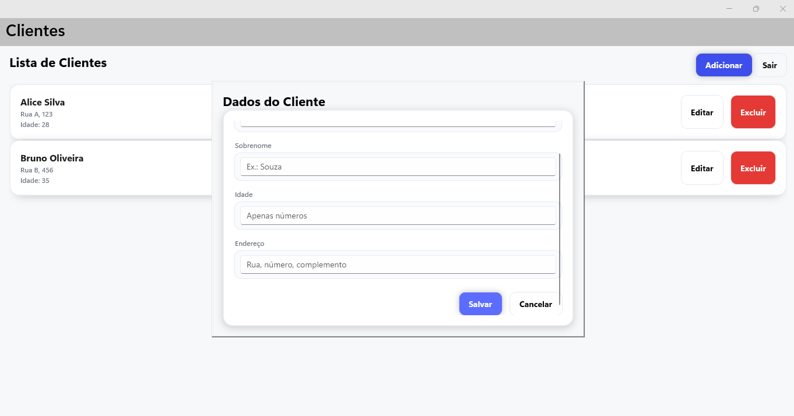

# BTG.ClientsApp

Aplicativo **.NET MAUI (Windows)** com CRUD de clientes (MVVM + CommunityToolkit) e **testes xUnit**.

## Telas do App 
  
  

## Tecnologias
- .NET 9 / MAUI (Windows)
- MVVM com `CommunityToolkit.Mvvm`
- Testes: xUnit, Moq, FluentAssertions
- DI nativa (`Microsoft.Extensions.DependencyInjection`)

## Requisitos
- Windows 10 19041+  
- .NET 9 SDK  
- Workload MAUI:
  ```bash
  dotnet workload install maui
 
